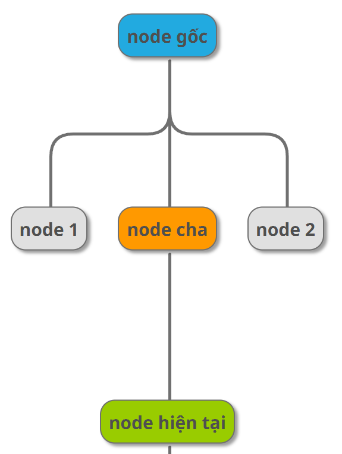
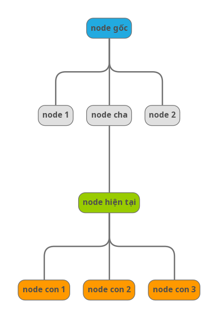
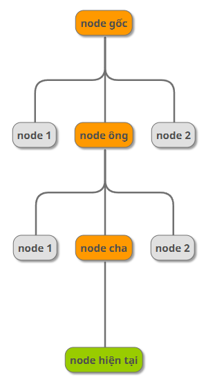
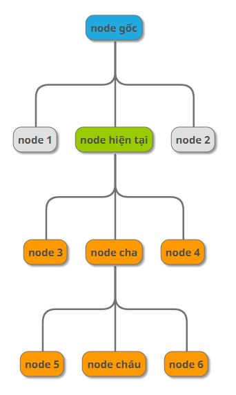
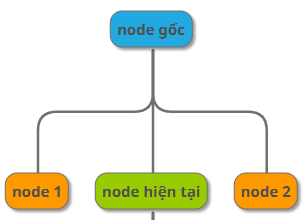
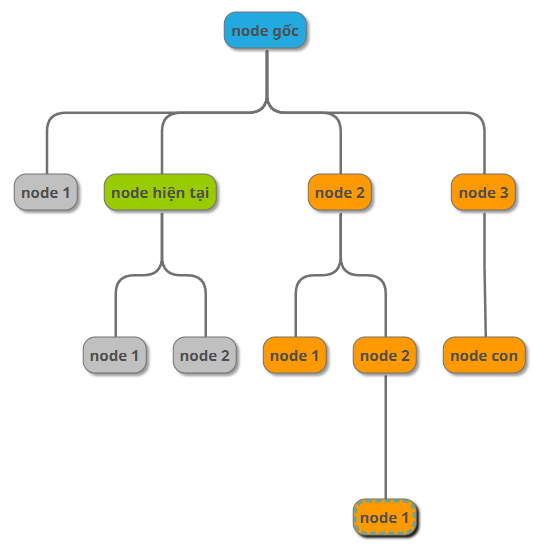
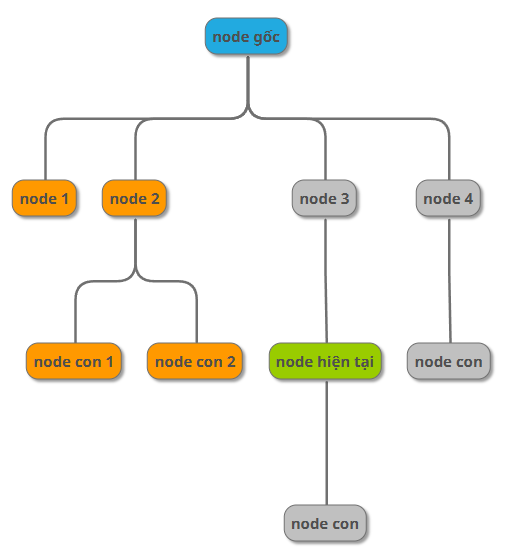
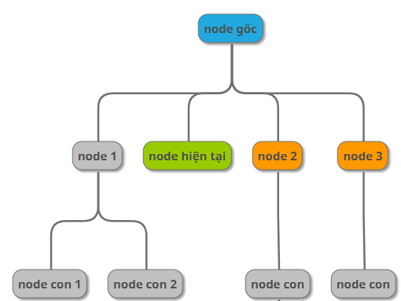
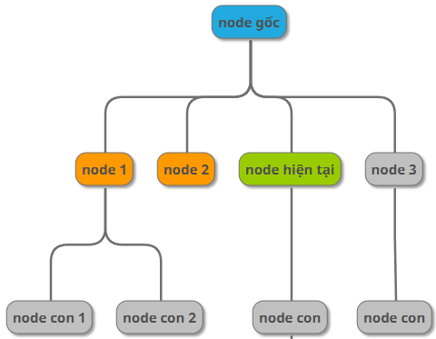

**DOM (Document Object Model)**
1. Các thẻ HTML thường gặp
- Thẻ ```<div>``` (divide): dùng để chia các khối trong trang web.
- Thẻ ```<h1></h1>``` đến ```<h6></h6>```(heading): dùng để tạo ra các header phân cấp theo thứ tự từ lớn đến bé.
- Thẻ ```<form></form>```: dùng để chứa một form thông tin.
- Thẻ input: text, email, radio, checkbox, file, color, range, date.
- Thẻ textarea: hiển thị ô input, dạng to.
- Thẻ radio button: tạo nút chọn một (radio type).
- Thẻ checkbox: tạo nút chọn nhiều lựa chọn (checkbox type).
- Thẻ list và dropdown: hiển thị danh sách hoặc menu thả xuống.
- Thẻ button: tạo nút bấm.
- Thẻ table: hiển thị bảng dữ liệu.
    
    - thead = table heading
         
         - tr = table row = 1 dòng

             - th: table heading: text in đậm
    - tbody

        - tr -> td = table data
- Thẻ date picker: tạo bộ chọn ngày.
- Thẻ slider: tạo thanh trượt.
- Thẻ iframe: hiển thị nội dung từ một trang web khác bên trong trang hiện tại.
2. Mối quan hệ trong DOM
- Parent: là node phía trên trực tiếp của node hiện tại.



- Child: là node phía dưới trực tiếp của node hiện tại.



- Ancestor: là toàn bộ các node màu vàng cam



- Descendant: là toàn bộ các node màu vàng cam



- Sibling: là những phần tử cùng cấp và cùng cha



- Following: là những phần tử ở phía bên tay phải của node hiện tại. **Không lấy những node con của node hiện tại**



- Preceding: là những phần từ phái bên tay trái của node hiện tại, **trừ các node ancestor**



- Following-sibling: anh em phía sau



- Preceding-sibling: anh em phía trước



**Selector**
- Là cách chọn phần tử trên trang. Có nhiều kiểu:

    - **Xpath Selector**
    - CCSS selector
    - Playwright selector
1. XPath selector
- XPath = XML path
- Có 2 loại:
     
     - Tuyệt đối: đi dọc lần lượt theo cây Dom. Bắt đầu bởi 1 /
     ```/form/div/label```
     - Tương đối: tìm dựa vào đặc tính. Bắt đầu bởi 2 //
     ```
        //tenthe[@thuoctinh="giatri"]
        //input[@id="email"]
    ```
    - Nên dùng Xpath tương đối vì khi dùng xpath tuyệt đối vị trí thẻ bị thay đổi sẽ dẫn đến xpath tuyệt đối bị sai.
2. Advance method XPath
- wildcard: * : dấu sao này mọi element(mọi thẻ) có thuộc tính là

  ```//*[@id="name"]```

- chứa thuộc tính: 

    ```//*[@checked]```

- and và or:

    ```//div[@id="name" and @checked]```

    ```//div[@id="name" or @checked]```
- innerText: text()

    ```//h1[text()="User Registration"]```

- normalise-space(): loại bỏ space ở 2 đầu

    ```//h1[normalise-space()="User Registration"]```

- contains:

    ```//h1[contains(text(), "User")]```

    ```//h1[contains(@id, "name")]```

- starts-with:

    ```//h1[starts-with(text(),"User")]```

- not: ít dùng

    ```//h1[not(@id="name")]``` sẽ lấy xpath mà ko có id = name

3. XPath: axes

```///tag/relationship::tagname[@attribute='value']```

- parent
- child
- ancestor
- descendant
- following
- preceding
- following-sibling
- preceding-sibling

4. Playwright basic syntax
- test : đơn vị cơ bản để khai báo 1 test case
    ```
    import { test } from '@playwright/test';

    test('<tên test>', async ({ page }) => {
    // Code của test
    });
    ```

- step : đơn vị để khai báo từng step trong test case
    ```
    test('<tên test>', async ({ page }) => {
    await test.step('Tên step', async () => {
    // Code here
    });
    ```
- Basic actions:
    
    - Navigate
        ```
        await page.goto('https://pw-practice.playwrightvn.com/');
        ```
    - Click
    
        - Single click ```await page.locator("//button").click();```

        - Double click ```await page.locator("//button").   dblclick();```

        - Click chuột phải
            ```
            page.locator("//button").click({
            button: 'right'
            })
             ```
        - Click chuột kèm bấm phím khác
            ```
            page.locator("").click({
            modifiers: ['Shift'],
            })
            ```
    - Input

        - Fill: giống việc copy paste content vào ô input 

            ```page.locator("//input").fill('Playwright Viet Nam');```
        - pressSequentially

            ```
            page.locator("//input").pressSequentially('Playwright Viet Nam', {delay: 100});
            ```
    - Radio/ checkbox

        - Lấy giá trị hiện tại đang là check hay không

            ```
            const isChecked = page.locator("//input").isChecked();
            ```
        - Check/ uncheck
            ```
            page.locator("//input").check();
            page.locator("//input").setChecked(false);
            ```
    - Select option

        - Single selection matching the value or label

            ```await page.locator("//select").selectOption("blue");```

        - Single selection matching the label
            ```await page.locator("//select").selectOption({ label: 'Blue' });```
        
        - Multiple selection
            ```await page.locator("//select").selectOption(['red', 'green','blue']);```
        
    - Set Input File
        ```await page.locator("//input").setInputFiles("path_file");```
    
    - Bounding box & position
    
        Lấy tọa độ, kích thước của element

        ```
        const box = await page.locator("#starRating").boundingBox();
        ```

        Tính toán tọa độ chính xác cho position
        ```
        x = starRatingBounding.width / 2;
        y = starRatingBounding.height / 2;

        await page.locator("#starRating").click({
                position: {
                    x: x,
                    y: y
                }
        })
        ```
